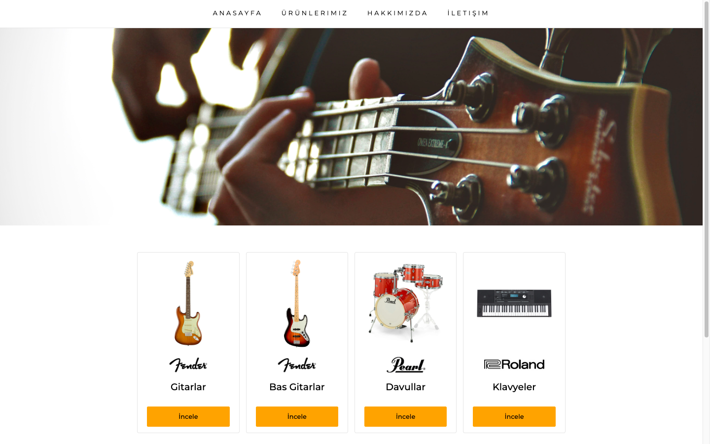
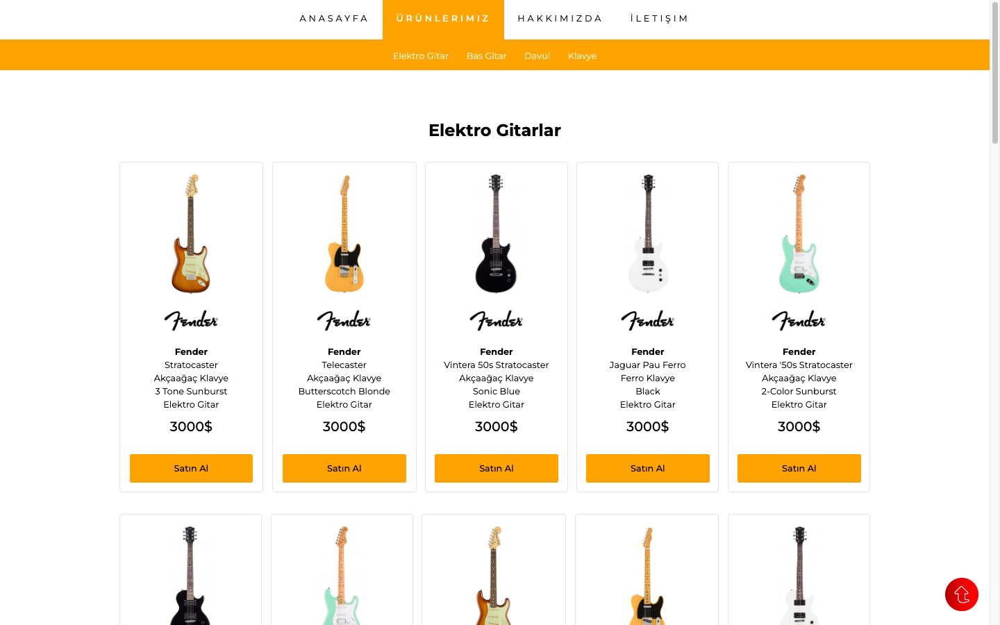
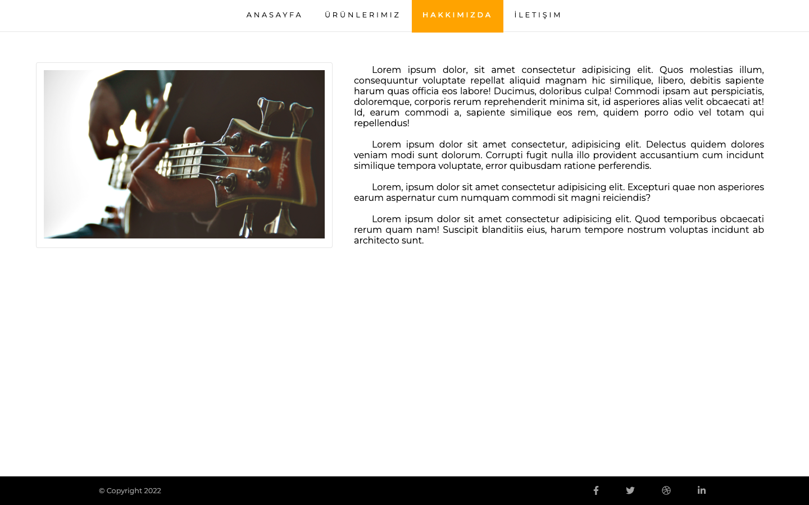
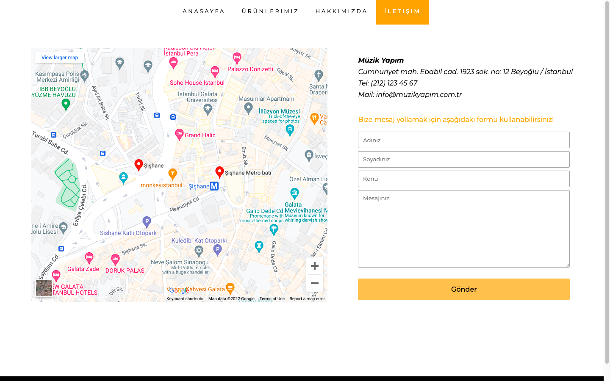

# Patika - Css Eğitimi - Ödev 1
Bu repo [Patika](http://www.patika.dev) sitesi css eğitimi 1. ödevi için oluşturulmuştur.

> Navigasyon butonların default ve hover kodları
> 
```css

.container header nav ul li a {
padding: 1.5em;
color: black;
text-transform: uppercase;
letter-spacing: 0.3em;
font-size: 0.8rem;
transition: all 0.1s ease-in-out;
}

.container header nav ul li a:hover{
	color: orange;
  font-weight: 500;
	border-bottom: 5px solid #a2a2a2;
  cursor: pointer;
  transform: scale(1);
}

```

> Ürünlerimiz sayfasında yer alan "Satın Al" butonlarının default ve hover kodları

```

.container main section article div button{
    border: none;
    padding: 1em 5em;
    background-color: orange;
    border-radius: 0.2em;
    font-size: 1em;
    font-weight: 500;
    cursor: pointer;
    transition: all 0.4s ease-in-out;
}
.container main section article div button:hover{
    background-color: lightgreen;
    color: white;
    transform: scale(1);
}

```

# Ekran Görüntüleri

## Anasayfa


## Ürünlerimiz


## Hakkımızda


## İletişim

